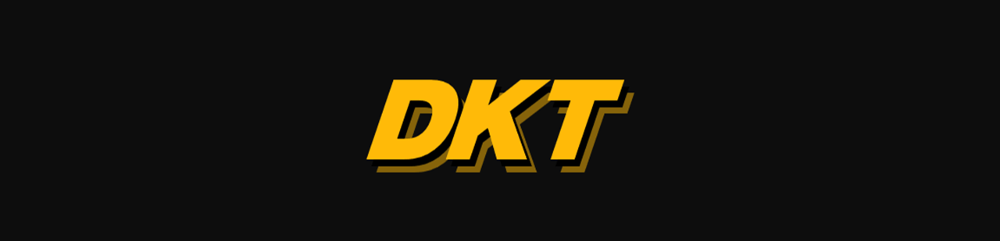
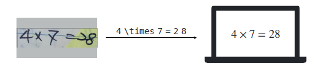
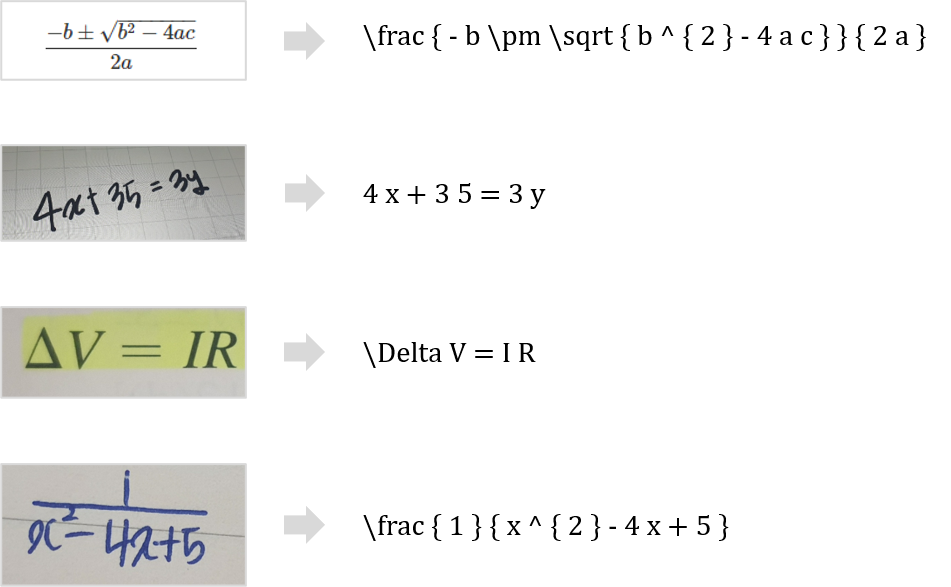

<div align="center">
    <h1>Formula Image Latex Recognition</h1>
    
    <br/>
    
    
    
    
</div>

---

## 📝 Table of Contents

- [Latex Recognition Task](#-latex-recognition-task)
- [Installation](#-installation)
- [File Structure](#-file-structure)
- [Getting Started](#-getting-started)
  - [Installation](#installation)
  - [Dataset Setting](#dataset-setting)
  - [Config Setting](#config-setting)
- [Usage](#-usage)
  - [Train](#train)
  - [Inference](#inference)
- [Demo](#-demo)
- [References](#-references)
- [Contributors](#-contributors)
- [License](#-license)

---

## ➗ Latex Recognition Task

<div align="center">
  
</div>

수식 인식(Latex Recognition)은 **수식 이미지에서 LaTeX 포맷의 텍스트를 인식하는 태스크**로, 문자 인식(Character Recognition)과 달리 수식 인식의 경우 `좌 → 우` 뿐만 아니라 Multi-line에 대해서 `위 → 아래`에 대한 순서 패턴 학습도 필요하다는 특징을 가집니다.

## 📁 File Structure

### Code Folder

```text
ocr_teamcode/
│
├── config/                   # train argument config file
│   ├── Attention.yaml
│   └── SATRN.yaml
│
├── data_tools/               # utils for dataset
│   ├── download.sh           # dataset download script
│   ├── extract_tokens.py     # extract tokens from token.txt
│   ├── make_dataset.py       # sample dataset
│   ├── parse_upstage.py      # convert JSON ground truth file to ICDAR15 format
│   └── train_test_split.py   # split dataset into train and test dataset
│
├── networks/                 # network, loss
│   ├── Attention.py
│   ├── SATRN.py
│   └── loss.py
│   └── spatial_transformation.py
│
├── checkpoint.py             # save, load checkpoints
├── pre_processing.py         # preprocess images with OpenCV
├── custom_augment.py         # image augmentations
├── transform.py
├── dataset.py
├── flags.py                  # parse yaml to FLAG format
├── inference.py              # inference
├── metrics.py                # calculate evaluation metrics
├── scheduler.py              # learning rate scheduler
├── train.py                  # train
└── utils.py                  # utils for training
```

### Dataset Folder

```text
input/data/train_dataset
│
├── images/                 # input image folder
│   ├── train_00000.jpg
│   ├── train_00001.jpg
│   ├── train_00002.jpg
│   └── ...
|
├── gt.txt                  # input data
├── level.txt               # formula difficulty feature
├── source.txt              # printed output / hand written feature
└── tokens.txt              # vocabulary for training
```

## ✨ Getting Started

### Installation

```shell
pip install -r requirements.txt
```

- scikit_image==0.14.1
- opencv_python==3.4.4.19
- tqdm==4.28.1
- torch==1.7.1+cu101
- torchvision==0.8.2+cu101
- scipy==1.2.0
- numpy==1.15.4
- pillow==8.2.0
- tensorboardX==1.5
- editdistance==0.5.3
- python-dotenv==0.17.1
- wandb==0.10.30
- adamp==0.3.0
- python-dotenv==0.17.1

### Download Dataset

```shell
sh filename.sh
```

### Dataset Setting

> <b>📌 학습데이터는 [Dataset Folder](#dataset-folder)와 같이 넣어주세요!</b>

> <b>📌 단일 컬럼으로 구성된 txt는 `\n`을 기준으로 데이터를 구분하며, 2개 이상의 컬럼으로 구성된 txt는 `\t`로 컬럼을, `\n`으로 데이터를 구분합니다.</b>

학습데이터는 `tokens.txt`, `gt.txt`, `level.txt`, `source.txt` 총 4개의 파일과 이미지 폴더로 구성되어 있습니다.

이 중 `tokens.txt`와 `gt.txt`는 **모델 학습**에 꼭 필요한 입력 파일이며, `level.txt`, `source.txt`는 이미지에 대한 메타 데이터로 **데이터셋 분리**에서 사용합니다.

- `tokens.txt`는 **학습에 사용되는 vocabulary 파일**로서 모델 학습에 필요한 token들이 정의되어 있습니다.

  ```text
  O
  \prod
  \downarrow
  ...
  ```

- `gt.txt`는 **실제 학습에 사용하는 파일**로 이미지 경로, LaTex로 된 Ground Truth로 각 컬럼이 구성되어 있습니다.

  ```text
  train_00000.jpg	4 \times 7 = 2 8
  train_00001.jpg	a ^ { x } > q
  train_00002.jpg	8 \times 9
  ...
  ```

- `level.txt`는 **수식의 난이도 정보 파일**로 각 컬럼은 경로와 난이도로 구성되어 있습니다. 각 숫자는 1(초등), 2(중등), 3(고등), 4(대학), 5(대학 이상)을 의미합니다.

  ```text
  train_00000.jpg	1
  train_00001.jpg	2
  train_00002.jpg	2
  ...
  ```

- `source.txt`는 이미지의 출력 형태 정보 파일로, 컬럼은 경로와 소스로 구성되어 있습니다. 각 숫자는 0(프린트 출력물), 1(손글씨)를 뜻합니다.

  ```text
  train_00000.jpg	1
  train_00001.jpg	0
  train_00002.jpg	0
  ```

### Create .env for wandb

wandb logging을 사용 시 wandb에 넘겨주어야 하는 인자를 `.env` 파일에 정의합니다.

```
PROJECT="[wandb project name]"
ENTITY="[wandb nickname]"
```

### Config Setting

학습 시 사용하는 config 파일은 `yaml`파일로 학습 목표에 따라 다음과 같이 설정해주세요.

```yaml
network: SATRN
input_size: # resize image
  height: 48
  width: 192
SATRN:
  encoder:
    hidden_dim: 300
    filter_dim: 1200
    layer_num: 6
    head_num: 8

    shallower_cnn: True # shallow CNN
    adaptive_gate: True # A2DPE
    conv_ff: True # locality-aware feedforward
    separable_ff: True # only if conv_ff is True
  decoder:
    src_dim: 300
    hidden_dim: 300
    filter_dim: 1200
    layer_num: 3
    head_num: 8

checkpoint: "" # load checkpoint
prefix: "./log/satrn" # log folder name

data:
  train: # train dataset file path
    - "/opt/ml/input/data/train_dataset/gt.txt"
  test: # validation dataset file path
    -
  token_paths: # token file path
    - "/opt/ml/input/data/train_dataset/tokens.txt" # 241 tokens
  dataset_proportions: # proportion of data to take from train (not test)
    - 1.0
  random_split: True # if True, random split from train files
  test_proportions: 0.2 # only if random_split is True, create validation set
  crop: True # center crop image
  rgb: 1 # 3 for color, 1 for greyscale

batch_size: 16
num_workers: 8
num_epochs: 200
print_epochs: 1 # print interval
dropout_rate: 0.1
teacher_forcing_ratio: 0.5 # teacher forcing ratio
teacher_forcing_damp: 5e-3 # teacher forcing decay (0 to turn off)
max_grad_norm: 2.0 # gradient clipping
seed: 1234
optimizer:
  optimizer: AdamP
  lr: 5e-4
  weight_decay: 1e-4
  selective_weight_decay: True # no decay in norm and bias
  is_cycle: True # cyclic learning rate scheduler
label_smoothing: 0.2 # label smoothing factor (0 to off)

patience: 30 # stop train after waiting (-1 for off)
save_best_only: True # save best model only

fp16: True # mixed precision

wandb:
  wandb: True # wandb logging
  run_name: "sample_run" # wandb project run name
```

## ⏩ Usage

### Train

```shell
python train.py [--config_file]
```

- `--config_file`: config 파일 경로

### Inference

```shell
python inference.py [--checkpoint] [--max_sequence] [--batch_size] [--file_path] [--output_dir]
```

- `--checkpoint`: checkpoint 파일 경로
- `--max_sequence`: inference 시 최대 시퀀스 길이
- `--batch_size`: 배치 크기
- `--file_path`: test dataset 경로
- `--output_dir`: inference 결과 저장 디렉토리

## 🚀 Demo

<div align="center">

</div>

## 📖 References

- <i>On Recognizing Texts of Arbitrary Shapes with 2D Self-Attention, Lee et al., 2019</i>
- <i>Bag of Tricks for Image Classi􎙟cation with Convolutional Neural Networks, He et al., 2018</i>
- <i>Averaging Weights Leads to Wider Optima and Better Generalization, Izmailov et al., 2018</i>
- <i>CSTR: Revisiting Classification Perspective on Scene Text Recognition, Cai et al., 2021</i>
- <i>Improvement of End-to-End Offline Handwritten Mathematical Expression Recognition by Weakly Supervised
  Learning, Truong et al., 2020</i>
- <i>ELECTRA: Pre-training Text Encoders As Discriminators Rather Than Generators, Clark et al., 2020</i>
- <i>SEED: Semantics Enhanced Encoder-Decoder Framework for Scene Text Recognition, Qiao et al., 2020</i>
- <i>Read Like Humans: Autonomous, Bidirectional and Iterative Language Modeling for Scene Text Recognition,
  Fang et al., 2021</i>
- <i>Google’s Neural Machine Translation System: Bridging the Gap between Human and Machine Translation, Wu et
  al., 2016</i>

## 👩‍💻 Contributors

|                           **[김종영](https://github.com/kjy93217)**                            |                           **[민지원](https://github.com/peacecheejecake)**                            |                                                    **[박소현](https://github.com/CoodingPenguin)**                                                    |                              **[배수민](https://github.com/bsm8734)**                               |                           **[오세민](https://github.com/osmosm7)**                            |                              **[최재혁](https://github.com/opijae)**                               |
| :--------------------------------------------------------------------------------------------: | :---------------------------------------------------------------------------------------------------: | :---------------------------------------------------------------------------------------------------------------------------------------------------: | :-------------------------------------------------------------------------------------------------: | :-------------------------------------------------------------------------------------------: | :------------------------------------------------------------------------------------------------: |
| [](https://github.com/kjy93217) | [](https://github.com/peacecheejecake) | [](https://github.com/CoodingPenguin) | [](https://github.com/bsm8734) | [](https://github.com/osmosm7) | [](https://github.com/opijae) |

## ✅ License

Distributed under the MIT License. See `LICENSE` for more information.
